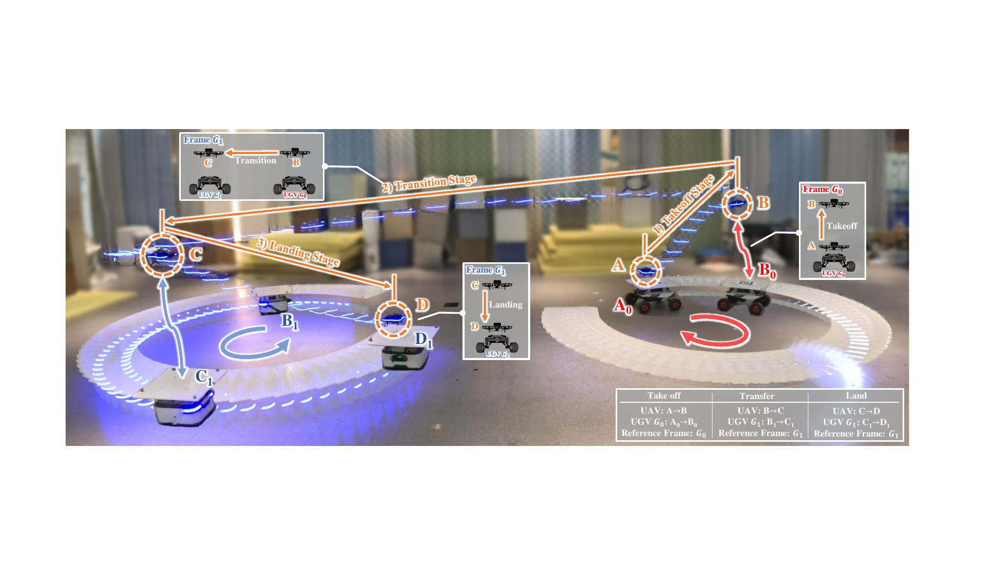

**Research Assistant, [FAST Lab](https://fast-fire.github.io/), Zhejiang University, 2023-2025.**

I contributed to COVER, a published quadrotor-control framework for smooth cross-vehicle UAV transfer between moving UGVs.

The framework controls the UAV in UGV body frames modeled as non-inertial frames, eliminating dependence on a global world-frame trajectory.

It decomposes the maneuver into initial, transition, and final stages, generates dynamically feasible references through nonlinear programming, and uses a stage-adaptive MPC to suppress frame-switching instability and avoid indirect transition routes.

I assisted with real-world experiments, where we achieved the first smooth, short-distance, and accurate cross-vehicle transition demonstration in this system.
