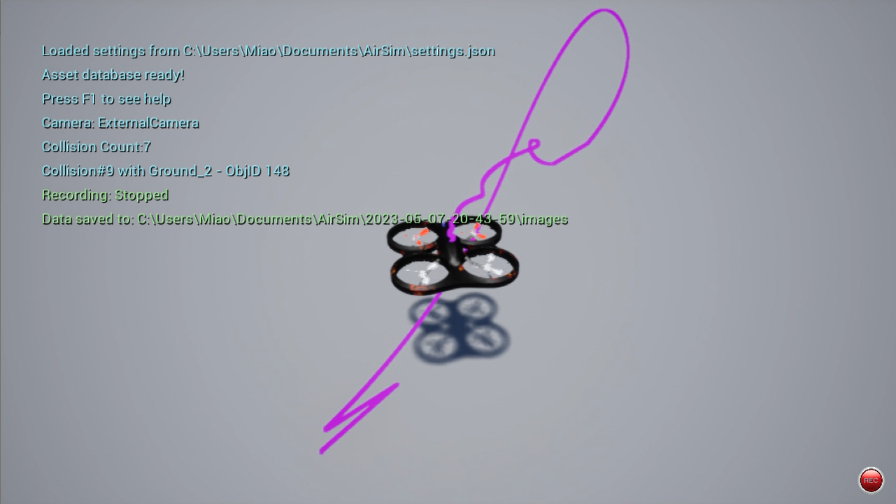
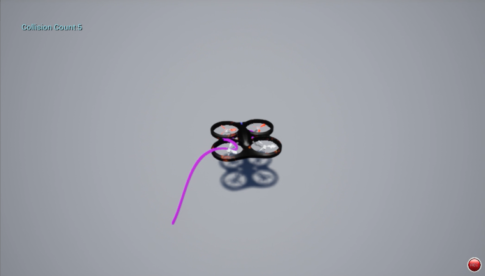

**Undergraduate Thesis, 2022-2023.**

I studied robust low-level control for quadcopter trajectory tracking under model uncertainty and external disturbances.

I built a MATLAB/Simulink quadcopter simulation platform and designed cascaded PID and cascaded LADRC controllers, where LADRC actively estimates and compensates for disturbances during flight.

I compared the controllers through hovering, disturbance-rejection, robustness, and Pixhawk-AirSim hardware-in-the-loop tests.

The results showed that LADRC achieved stronger disturbance rejection and more stable tracking than PID under uncertain flight conditions.
