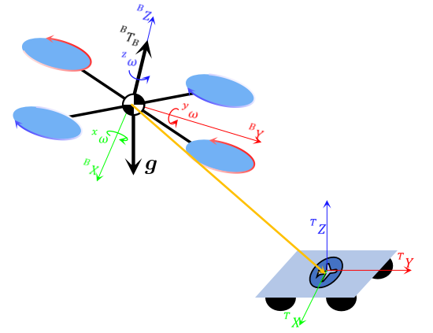
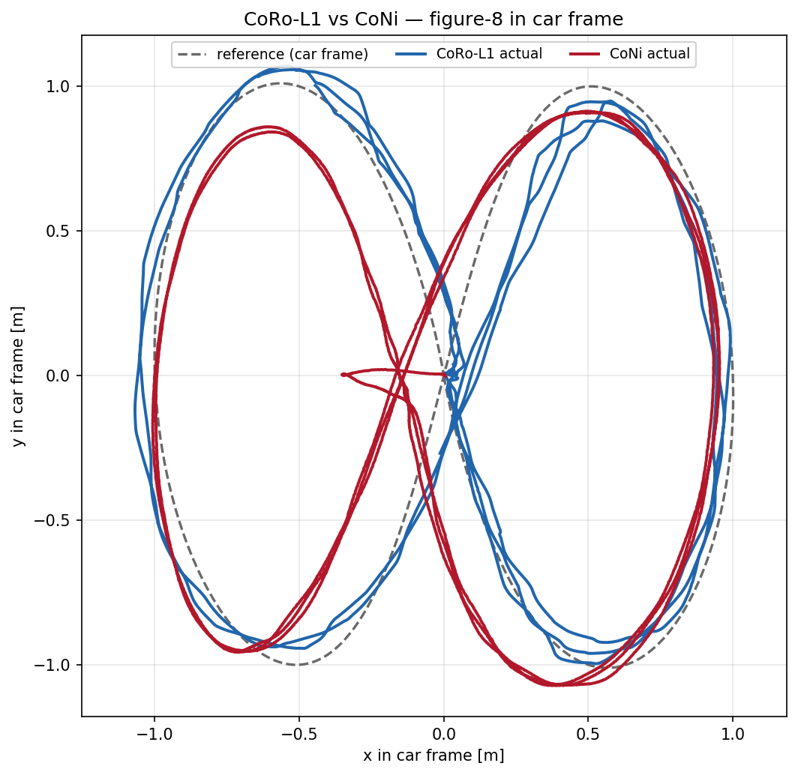

**Research Assistant, [FAST Lab](https://fast-fire.github.io/), Zhejiang University, 2023-2025.**

I developed a robocentric L1-adaptive NMPC framework for UAV tracking and landing on moving ground platforms from inter-robot relative-state estimates.

Unlike CoNi-MPC, which relies on target-side acceleration and angular-velocity measurements, the framework treats these unavailable platform-motion effects as matched and unmatched uncertainties, eliminating the need for direct UAV-UGV communication.

I augmented torque-level NMPC with filtered L1 compensation, motor-level feasibility constraints, and actuator-aware feedback.

In a low-agility figure-eight benchmark over a circling ground vehicle, the method reduced XY cross-track RMS error from 0.112 m for CoNi-MPC to **0.083 m**, corresponding to an improvement of approximately **26%**.
