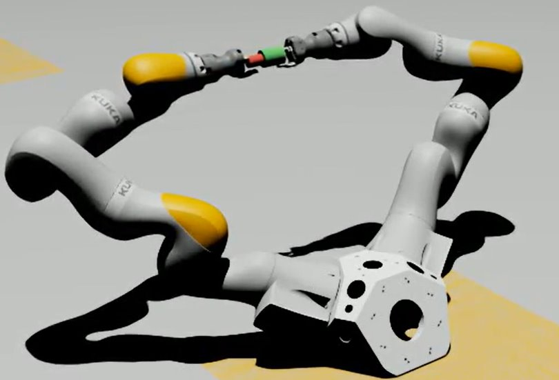
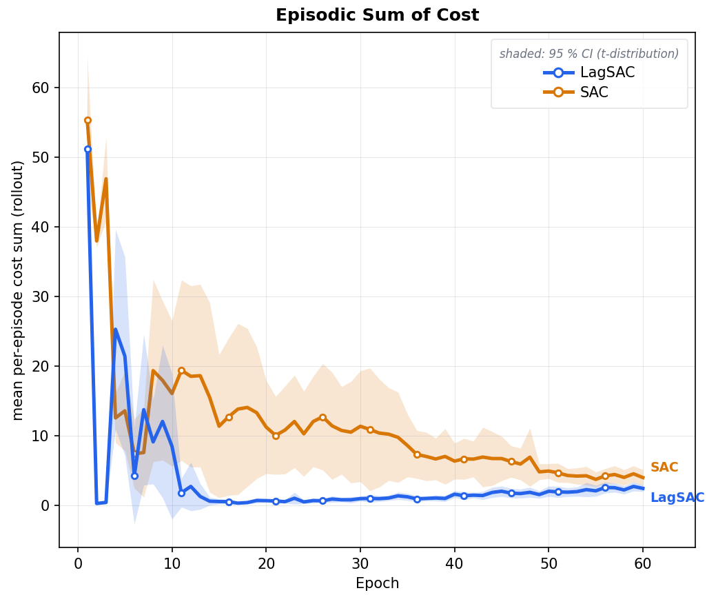

**Course Project, Lund University, 2026.**





I built an Isaac Sim benchmark for bimanual peg-in-hole manipulation with two KUKA iiwa arms, where a 14-DoF joint-velocity policy coordinates the peg and hole.

I formulated the task as a constrained reinforcement learning problem by separating geometric task reward from safety cost, using peg-in-hole progress as reward and clearance violations as the cost signal.

I implemented SAC and Lagrangian SAC under the same environment, reward, cost, and evaluation protocol, with multi-seed training, deterministic evaluation, and rollout-level cost analysis.

In the current 15-seed Stage-1 harder-pose benchmark, Lagrangian SAC reduced episodic cost from **4.011 to 2.456** and cumulative sphere-proxy clearance-violation events from **2575.0 to 516.8**, while maintaining comparable task performance.
